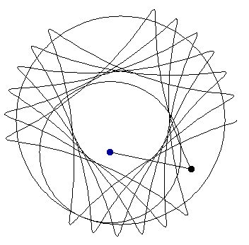

# _spyrograph_: elegant mathematics and geometries

<p align="center">
  
</p>

## What is it?
_spyrograph_ is a lightweight Python package that provides an expressive and flexible set of tools for drawing beautiful mathematically driven art. With just a few lines of easy-to-read code you can start analyzing, visualizing, and exploring elegant mathematics 

[](https://pepy.tech/project/spyrograph)
[](https://github.com/chris-greening/spyrograph/issues)
[](LICENSE)
[](https://pypi.org/project/spyrograph/)
[](https://spyrograph.readthedocs.io/en/latest/?badge=latest)

[](https://www.buymeacoffee.com/chrisgreening)

[Official website](https://chris-greening.github.io/spyrograph/)

[Official docs](https://spyrograph.readthedocs.io/en/latest/)

## Table of Contents
* [Key features](#key-features)
* [Installation](#installation)
* [Quickstart](#quickstart)
* [Contributing](#contributing)
* [Blog posts](#blog-posts)
* [Documentation](#documentation)
* [License](#license)
* [Support](#support)

---

## :key: Key features <a name="key-features"></a>
- Expressive and consistent syntax
- Robust underlying mathematics
- Beginner _and_ expert friendly
- `numpy` is the only required third-party installation
- Clear visualizations and animations
- Flexible to a wide range of usecases
- Lightweight, just plug and play

<p align="center">
  
</p>

---

## :computer: Installation <a name="installation"></a>

### pip
Install the latest stable release from PyPI using
```shell
$ pip3 install spyrograph
```

or clone the development version from GitHub with
```shell
$ git clone https://github.com/chris-greening/spyrograph.git
```

---

## :seedling: Quickstart <a name="quickstart"></a>

`spyrograph` is designed to be expressive and easy-to-use - simply `import spyrograph` and jump right into drawing elegant, complex shapes in just a few lines of code!

```python
from spyrograph import Hypotrochoid

# Trace a hypotrochoid from 0 to 2pi where
# the fixed circle radius is 300, rolling circle 
# radius is 200, and the distance from the rolling 
# circle is 100
hypotrochoid = Hypotrochoid(
    R=300,
    r=200,
    d=100,
    thetas=np.arange(0, 2*np.pi, .1)
)
hypotrochoid.trace(
    show_circles=True, 
    frame_pause=.05, 
    circle_color="grey"
)
```

---

## :pray: Contributing <a name="contributing"></a>
All contributions, bug reports, bug fixes, documentation improvements, enhancements, and ideas are welcome!

Feel free to [open an Issue](https://github.com/chris-greening/spyrograph/issues/new/choose), check out existing [Issues](https://github.com/chris-greening/spyrograph/issues), or [start a discussion](https://github.com/chris-greening/spyrograph/discussions). 

Beginners to open source are highly encouraged to participate and ask questions if you're unsure what to do/where to start

---

## :newspaper: Blog posts <a name="blog-posts"></a>
Check out the [official website](https://chris-greening.github.io/spyrograph/) for the latest blog posts on the project!

- [Draw beautiful geometric visualizations with Python and spyrograph](https://chris-greening.github.io/spyrograph/python/2023/03/11/draw-beautiful-geometric-visualizations-and-animations-with-python-and-spyrograph.html)
- [Configuring the trace method to explore stunning spirographs in Python](https://chris-greening.github.io/spyrograph/python,/tutorial/2023/03/24/configuring-the-trace-method-to-explore-stunning-spirographs-in-python.html)
- [Creating a range of hypotrochoids with the create_range method](https://chris-greening.github.io/spyrograph/python,/tutorial/2023/03/25/creating-a-range-of-hypotrochoids-with-the-create-range-method.html)
- [Plotting beautiful spirographs with matplotlib and spyrograph](https://chris-greening.github.io/spyrograph/python,/tutorial/2023/03/27/plotting-beautiful-spirographs-with-matplotlib-and-spyrograph.html)
- [Drawing cycloids with a specific number of cusps using spyrograph](https://chris-greening.github.io/spyrograph/python,/tutorial/2023/03/28/drawing-cycloids-with-a-specific-number-of-cusps-using-spyrograph.html)
- [Scaling trochoid’s and cycloid’s input parameters with the spyrograph scale method](https://chris-greening.github.io/spyrograph/python,/tutorial/2023/04/01/scaling-trochoids-and-cycloids-input-parameters-with-the-spyrograph-scale-method.html)
- [Spyrograph is looking for beginners to open source to contribute!](https://dev.to/chrisgreening/spyrograph-is-looking-for-beginners-to-open-source-to-contribute-1nbe)

---

## :books: Documentation <a name="documentation"></a>
The official documentation can be found on [Read The Docs](https://spyrograph.readthedocs.io/en/latest/index.html)

---

## :credit_card: License <a name="license"></a>
This library operates under the [MIT](LICENSE) license.

---

## :grey_question: Support <a name="support"></a>

Reach out to me if you want to connect or have any questions and I will do my best to get back to you
* Email:
  * chris@christophergreening.com
* Twitter:
  * [@ChrisGreening](https://twitter.com/ChrisGreening)
* LinkedIn
  * [Chris Greening](https://www.linkedin.com/in/chris-greening-646411139/)
* Personal contact form: 
  * [www.christophergreening.com](https://www.christophergreening.com/contact)
